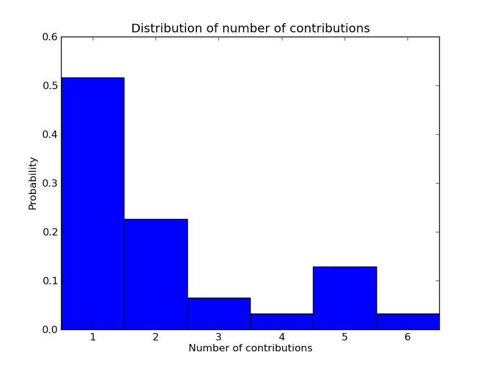

# A online (open) list of Mathematics Books
## Introduction
This site contains a list of books based on the [spreadsheet](https://docs.google.com/spreadsheet/ccc?key=0AvXhcaIlhi4udEFIN1ZSUTRpakotUEZ6QmlEOWNua3c&hl=en&forcehl=1#gid=0) put up by [+James Noble](https://plus.google.com/102137382870708304914/posts).

[The spreadsheet is completely open and contains a list of books as well as well as a list of other lists](https://docs.google.com/spreadsheet/ccc?key=0AvXhcaIlhi4udEFIN1ZSUTRpakotUEZ6QmlEOWNua3c&hl=en&forcehl=1#gid=0)

The list has been contributed to by 30 different contributors. As this page was compiled automatically and some of the contributors have left their email address (others their G+ page and/or twitter handle) I won't list them here in case it causes more spam but do go take a look at the spreadsheet :).

**Go ahead and add any book you have to the list!**

## Some initial analysis

I wrote some code to analyse (and in fact write the html behind this site) some aspects of the data set which (last time I checked) contains 65 books.

### Contributors

The list is completely open but some people seem to contribute more than others. Here's the distribution of the number of guesses:

### Authors

Similarly for the authors, here's the distribution of the number of books by author:

The most prolific author is J. SCOTT CARTER with 5 books in the list.

### Overview

The list contains a data field allowing people to describe the book. Here is a plot of the frequency of the 50 most used "uncommon" words (using the [nltk](http://nltk.org/) python library).

### Target

There is also a field briefly describing the target audience for the book. Here is a similar frequency count to above:

## The Books

Here is the actual list of books:
            
1 . [Anno's Three Little Pigs](http://www.amazon.co.uk/Annos-Three-Little-Pigs-Mitsumasa/dp/0370308980/ref=sr_1_cc_1?s=aps&ie=UTF8&qid=1337803173&sr=1-1-catcorr)

 **Authored** by Unkown
**Overview:**

> ''
                
**Target:**

> 'I love reading this to children who think they are going to be too old for it (year 7 say) as well as younger children who love math'
                
2 . [Thinking Mathematically  ](http://www.amazon.co.uk/Thinking-Mathematically-J-Mason/dp/0273728911/ref=sr_1_1?s=books&ie=UTF8&qid=1337804065&sr=1-1)

 **Authored** by Unkown
**Overview:**

> 'A step by step course on how to think and work mathematically. Lots of problems to work on and discussion on how to solve problems'
                
**Target:**

> '"Thinking Mathematically is perfect for anyone who wants to develop their powers to think mathematically, whether at school, at university or just out of interest.". '
                
3 . [G is for Googol](http://www.amazon.com/Is-Googol-Math-Alphabet-Book/dp/1883672589/ref=sr_1_1?ie=UTF8&qid=1349370905&sr=8-1&keywords=g+is+for+googol)

 **Authored** by DAVID M. SCHWARTZ, MARISSA MOSS
**Overview:**

> 'A math alphabet book'
                
**Target:**

> 'Perfect for all ages.  I share it with my students at the end of the year.  I then have them create their own as a review of the year.'
                
4 . [Even Better Mathematics](http://www.amazon.co.uk/Even-Better-Mathematics-Continuum-Education/dp/1855391473/ref=sr_1_1?s=books&ie=UTF8&qid=1369902606)

 **Authored** by AFZHAL  AHMED, HONOR WILLIAMS
**Overview:**

> 'Based on a project involving extensive classroom-based action research, this is an important book that looks at how teachers can improve students' achievement, attitudes, confidence and interest in mathematics. '
                
**Target:**

> 'Suitable for those concerned with mathematics education at all levels.'
                
5 . [Adventures in Numberland]()

 **Authored** by ALLEX BELLOS
**Overview:**

> 'Sideways look at the development and history of maths'
                
**Target:**

> 'NQT's looking to add a bit of back ground'
                
6 . [Approaches to Learning: A Guide for Educators](http://www.amazon.co.uk/Approaches-Learning-A-Guide-Educators/dp/0335226701/ref=sr_1_1?ie=UTF8&qid=1359221225&sr=8-1)

 **Authored** by ANNE JORDAN, ORISON CARLILE, ANNETTA STACK
**Overview:**

> 'Very good general book about education.'
                
**Target:**

> 'Educators in all fields'
                
7 . [Raising Achievement in Secondary Mathematics]()

 **Authored** by ANNE WATSON
**Overview:**

> 'A real challenge to the view that children in bottom sets cannot think mathematically. Passionately committed to social justice and to doing mathematics. Some excellent examples of good teaching described hre.'
                
**Target:**

> 'Teachers and mathematics educators at all levels'
                
8 . [Mathematics as a constructive activity: learners generating examples. ]()

 **Authored** by ANNE WATSON, JOHN MASON
**Overview:**

> 'Fascinating account with many examples of the key role of examples in teaching mathematics, and how to support pupils in developing their own'
                
**Target:**

> 'Teachers and mathematics educators at all levels'
                
9 . [Uncle petros  and the goldbach conjecture](http://www.amazon.com/Math-Book-Pythagoras-Milestones-Mathematics/dp/1402788290/ref=sr_1_1?s=books&ie=UTF8&qid=1369944821&sr=1-1&keywords=the+math+book+from+pythagoras+to+the+57th+dimension)

 **Authored** by APOSTOLOS DOXIADIS
**Overview:**

> 'From the author of Logicomix a great tale of one man's search for a proof of the Goldbach Conjecture. Although fictional it is a great story which weaves a narrative around many great historical figures in mathematics. '
                
**Target:**

> 'Teachers, and students who are interested in taking their studies further. '
                
10 . [Logicomix](http://www.amazon.com/Logicomix-An-Epic-Search-Truth/dp/1596914521/ref=pd_sim_b_1)

 **Authored** by APOSTOLOS DOXIADIS
**Overview:**

> 'A stunning graphical novel which explores the search for mathematical truth from the early foundations of mathematics to the work of Bertrand Russell. A great way to explore mathematics and philosophy with students.'
                
**Target:**

> 'Teachers, and students who are hoping to study maths at A level or higher. I have also used this book to work with A level History and Philosophy/RS students to explore the nature of mathematical thought. '
                
11 . [Bad Science](http://www.amazon.co.uk/Bad-Science-Ben-Goldacre/dp/000728487X/ref=sr_1_1?ie=UTF8&qid=1337958793&sr=8-1)

 **Authored** by BEN GOLDACRE
**Overview:**

> 'A bit like John Allen Paulos. Looks at how we should think about statistics carefully. Case studies include looking at homeopathy, speed cameras and food supplements. Worth reading for the chapter on Gillian McKeith alone. '
                
**Target:**

> 'Maths Studies students, or in fact anyone, who wants to know why statistics matters. '
                
12 . [Alvin's Secret Code](http://www.amazon.com/Alvins-Secret-Code-Panel-Mysteries/dp/1932350004/ref=sr_1_1?ie=UTF8&qid=1349407849&sr=8-1&keywords=alvin%27s+secret+code)

 **Authored** by CLIFFORD B. HICKS.
**Overview:**

> 'Classic children's fiction about codes, ciphers, and buried treasure.  Got me hooked on codes as a kid!'
                
**Target:**

> 'Kids into secret codes, perhaps 4th-8th graders and math teachers of all ages.'
                
13 . [The Math Book](http://www.amazon.com/Math-Book-Pythagoras-Milestones-Mathematics/dp/1402788290/ref=sr_1_1?s=books&ie=UTF8&qid=1369944821&sr=1-1&keywords=the+math+book+from+pythagoras+to+the+57th+dimension)

 **Authored** by CLIFFORD PICKOVER
**Overview:**

> '250 milestones in the history of mathematics. With some stunning images. Worth getting for the images alone, and the hairy ball theorem!'
                
**Target:**

> 'Teachers and students either hoping to study A level or currently doing so. I have used images in class and also some of the examples it contains to inspire students. '
                
14 . [The State of the World Atlas](http://www.amazon.co.uk/State-World-Atlas-Earthscan-Series/dp/1844075737/ref=sr_1_1?ie=UTF8&qid=1349343090&sr=8-1)

 **Authored** by DAN SMITH
**Overview:**

> 'Infographics showing some frightening and relevant statistics about the world we live in. There is a new edition due in 2013 '
                
**Target:**

> 'From my experience everyone enjoys flicking through this book and it can be a great duscusion starter to ask related questions. It has also isnpsired some good project work.'
                
15 . [1089 and all that](http://www.amazon.co.uk/1089-All-That-Journey-Mathematics/dp/0198516231)

 **Authored** by DAVID ACHESON
**Overview:**

> 'A journey into mathematical thinking'
                
**Target:**

> 'GCSE and above (including teachers)'
                
16 . [Information is beautiful](http://www.amazon.co.uk/Information-Beautiful-David-McCandless/dp/0007294662/ref=sr_1_1?ie=UTF8&qid=1349343260&sr=8-1)

 **Authored** by DAVID MCCANDLESS
**Overview:**

> 'More infographics on all sorts of topics. A very inetersting book which begs lots of questions '
                
**Target:**

> 'As above really'
                
17 . [The Parrot's Theorem](http://www.amazon.co.uk/Parrots-Theorem-Denis-Guedj/dp/0753811073)

 **Authored** by DENIS GUEDJ
**Overview:**

> 'An exploration of the story of maths, from brilliant Greek thinkers, such as Archimedes and Pythagoras, to the modern-day genius Fermat'
                
**Target:**

> 'Teachers, but with passages to be read to pupils, or to inspire KS4/5 pupils to think more holistically about mathematical themes'
                
18 . [Flatland](http://www.amazon.com/Flatland-Romance-Dimensions-Thrift-Editions/dp/048627263X)

 **Authored** by EDWIN A ABBOT
**Overview:**

> 'Flatland is one of the very few novels about math and philosophy that can appeal to almost any layperson. Published in 1880, this short fantasy takes us to a completely flat world of two physical dimensions where all the inhabitants are geometric shapes, and who think the planar world of length and width that they know is all there is. But one inhabitant discovers the existence of a third physical dimension, enabling him to finally grasp the concept of a fourth dimension. Watching our Flatland narrator, we begin to get an idea of the limitations of our own assumptions about reality, and we start to learn how to think about the confusing problem of higher dimensions.'
                
**Target:**

> 'People interested in geometry, higher dimensions, and a fiction story grounded in mathematics. The book is easy to read but stretches your perceptions of our world through the story of a character in a 2 dimensional world who dares to consider 3 dimensions. The book helps the reader to conceptualize the 4th dimension and higher dimensional understanding. I have considered using excerpts from the book in a middle or high school classroom because of how easy it is to read and understand.'
                
19 . [Flatland](http://www.amazon.co.uk/Flatland-Romance-Dimensions-Oxford-Classics/dp/019953750X/ref=sr_1_2?ie=UTF8&qid=1337804767&sr=8-2)

 **Authored** by EDWIN A ABBOTT
**Overview:**

> 'A short novel exploring a 2-dimensional world, and exploring how someone from such a world would perceive 3 dimensions'
                
**Target:**

> 'Teachers and students. Challenges philosophical outlook in maths and life in general'
                
20 . [e: The Story of a Number](http://www.amazon.com/Story-Number-Princeton-Science-Library/dp/0691141347)

 **Authored** by ELI MAOR
**Overview:**

> 'History,derivations and mathematical connections.'
                
**Target:**

> 'Teachers (especially those teaching A-Level or IB) and students over 16.'
                
21 . [The Number Devil: A Mathematical Adventure](http://www.amazon.co.uk/Number-Devil-Mathematical-Adventure/dp/1847080537/ref=sr_1_1?s=books&ie=UTF8&qid=1337803521&sr=1-1#)

 **Authored** by HANS MAGNUS ENZENSBERGER
**Overview:**

> 'Children's story book about a boy who doesn't like maths at school but learns to love is in his dreams. It is quite long, with chapters on a range of different mathematical ideas, '
                
**Target:**

> 'Anyone who doesn't like maths because they think it's all about being good at arithmetic '
                
22 . [Modern Mathematicians](http://www.amazon.com/Modern-Mathematicians-Global-Profiles-Henderson/dp/0816032351/ref=sr_1_1?ie=UTF8&qid=1369942058&sr=8-1&keywords=Modern+Mathematicians)

 **Authored** by HARRY HENDERSON
**Overview:**

> 'Global Profiles provides current, thorough coverage of some of the most significant figures in history with 13 mathematicians who have revolutionized modern thought and technology.'
                
**Target:**

> 'Students and teachers will enjoy the book, this book is great for students doing research projects on modern mathematicians.  The book is older, but still has some great mathematicians.'
                
23 . [Letters to a young mathematician](http://www.amazon.co.uk/Letters-Young-Mathematician-Art-Mentoring/dp/0465082327/ref=sr_1_1?ie=UTF8&qid=1337922387&sr=8-1)

 **Authored** by IAN STEWART
**Overview:**

> 'Written as a series of letters by a professor to a niece going to college. Covers philosophical and practical questions concerning "Math" and the learning of it. '
                
**Target:**

> 'Perfect for able mathematicians aged 17 upwards, particularly if they are soon to enter or have already entered university reading Maths. '
                
24 . [A hoard of mathematical treasures](http://www.amazon.com/Professor-Stewarts-Hoard-Mathematical-Treasures/dp/0465017754/ref=sr_1_1?ie=UTF8&qid=1369944275&sr=8-1&keywords=A+hoard+of+mathematical+treasures)

 **Authored** by IAN STEWART
**Overview:**

> 'Great book to dip into to inspire students. Lots of odd and arcane facts to bring the subject alive!'
                
**Target:**

> 'A great read for students and teachers alike, KS3 and above'
                
25 . [Proofs and Refutations](http://www.amazon.co.uk/Proofs-Refutations-Logic-Mathematical-Discovery/dp/0521290384/ref=sr_1_1?ie=UTF8&qid=1369902069)

 **Authored** by IMRE LAKATOS
**Overview:**

> 'A book that takes the form of a conversation between a teacher and pupils as they consider Eulers Theorem (V-E+F=2). But it goes deeply into the methodology and philosophy of mathematics as they make conjectures, provide refutations, and move towards proofs. It mirrors what can go on in the classroom. '
                
**Target:**

> 'Teachers of Mathematics, both classroom and those in training. Those carrying out research about mathematics education and especially proof. '
                
26 . [How Surfaces Intersect in space](http://www.amazon.com/Surfaces-Intersect-Space-Knots-Everything/dp/9810220669/ref=la_B001HPHFA0_1_1?ie=UTF8&qid=1370129865&sr=1-1)

 **Authored** by J. SCOTT CARTER
**Overview:**

> 'An introduction to some of the ideas in topology.'
                
**Target:**

> 'Students, teachers, lay people.'
                
27 . [An Excursion in Diagrammatic Algebra: Turning a Sphere from Red to Blue](http://www.amazon.com/Excursion-Diagrammatic-Algebra-Turning-Everything/dp/9814374490/ref=la_B001HPHFA0_1_4?ie=UTF8&qid=1370129865&sr=1-4)

 **Authored** by J. SCOTT CARTER
**Overview:**

> 'A classical sphere eversion is created by means of movie moves. The singularities and the stages of the eversion are presented as explicitly as possible.'
                
**Target:**

> 'Mathematician, topologists, mathematical artists, students who want to gain a flavor of that which is mathematics.'
                
28 . [The Classical and Quantum 6j symbols](http://www.amazon.com/Classical-Quantum-6j-symbols-MN-43/dp/0691027307/ref=la_B001HPHFA0_1_2?ie=UTF8&qid=1370129865&sr=1-2)

 **Authored** by J. SCOTT CARTER, DANIEL FLATH, MASAHICO SAITO
**Overview:**

> 'The diagrammatic approach to representations of classical and quantum sl(2)'
                
**Target:**

> 'Mathematics graduate students, physicists, topologists'
                
29 . [Knotted Surfaces and Their Diagrams](http://www.amazon.com/Knotted-Surfaces-Diagrams-Mathematical-Monographs/dp/0821805932/ref=la_B001HPHFA0_1_3?ie=UTF8&qid=1370129865&sr=1-3)

 **Authored** by J. SCOTT CARTER, MASAHICO SAITO
**Overview:**

> 'An introduction to the theory of knotted surfaces from the point of view of diagrams and movies '
                
**Target:**

> 'Mathematics graduate students,  topologists'
                
30 . [Surfaces in 4-space](http://www.amazon.com/Surfaces-4-Space-Scott-Carter/dp/3540210407/ref=la_B001HPHFA0_1_5?ie=UTF8&qid=1370129865&sr=1-5)

 **Authored** by J. SCOTT CARTER, SEIICHI KAMADA, MASAHICO SAITO
**Overview:**

> 'A sequel to Knotted Surfaces and Their Diagrams. More details are presented and the quandle cocycle invariants are defined.'
                
**Target:**

> 'Mathematics graduate students, topologists.'
                
31 . [The elephant in the classroom](http://www.amazon.co.uk/The-Elephant-Classroom-Helping-Children/dp/0285638750/ref=sr_1_1?ie=UTF8&qid=1369939737&sr=8-1&keywords=elephant+in+the+classroom)

 **Authored** by JO BOALER
**Overview:**

> 'Discusses the disparity between real world maths and the maths children often do in classrooms.  An inspirational read to help you rethink how you teach maths in schools.  Focusses on problem-based learning and rich tasks amongst other things..  '
                
**Target:**

> 'Teachers and maths subject leaders at primary or secondary level'
                
32 . [A Mathemetician reads the newspaper](http://www.amazon.com/Mathematician-Reads-Newspaper-Allen-Paulos/dp/038548254X)

 **Authored** by JOHN ALLEN PAULOS
**Overview:**

> 'The book goes through different news articles highlighting the role of understanding or (misunderstanding) mathematics in understanding the news.'
                
**Target:**

> 'A great read all round forteachers, students and parents a like, but great for dipping in and out of. I have read aloud from this in class and it has inspired some activies as well. '
                
33 . [Innumeracy](http://www.amazon.com/Innumeracy-Mathematical-Illiteracy-Consequences-Vintage/dp/0679726012)

 **Authored** by JOHN ALLEN PAULOS
**Overview:**

> 'Mathematical illiteracy and its consequences - the title says it all'
                
**Target:**

> ''
                
34 . [Math Curse](http://www.amazon.com/Math-Curse-Jon-Scieszka/dp/0670861944/ref=sr_1_1?ie=UTF8&qid=1349345457&sr=8-1&keywords=math+curse)

 **Authored** by JON SCIESZKA, LANE SMITH
**Overview:**

> 'Children's book about a child who sees everything as a math problem.'
                
**Target:**

> 'Perfect for all ages.  One of my math education professors read it to us in college.  I've used it with my elementary school students.  It's got great pictures to go along with the story.'
                
35 . [Bats on Parade](http://www.amazon.com/Bats-parade-Kathi-Appelt/dp/0439207096/ref=sr_1_1?ie=UTF8&qid=1349405004&sr=8-1&keywords=bats+on+parade)

 **Authored** by KATHI APPELT
**Overview:**

> 'A book about perfect squares'
                
**Target:**

> 'Perfect for all ages.  It's a great book that I got through Scholastic for my son without realizing that it was a math book.  The animals march in the parade in perfect squares.'
                
36 . [Math on Trial](http://www.amazon.co.uk/Math-Trial-Numbers-Abused-Courtroom/dp/0465032923)

 **Authored** by LEILE SCHNEPS, CORALIE COLMEZ
**Overview:**

> 'Another book that I can't reccomend from personal experience, but a quick look at some of the stories in here suggests it would be ideal for getting to grips with conditional probability '
                
**Target:**

> 'For anyone teaching probability, anyone interested in applications of statistics, or anyone trying to get to grips with conditional probability'
                
37 . [Euclid's Window](http://www.amazon.com/Euclids-Window-Geometry-Parallel-Hyperspace/dp/0684865246/ref=sr_1_1?s=books&ie=UTF8&qid=1370021171&sr=1-1&keywords=Euclid%27s+Window)

 **Authored** by LEONARD MLODINOW
**Overview:**

> 'Through Euclid's Window Leonard Mlodinow brilliantly and delightfully leads us on a journey through five revolutions in geometry, from the Greek concept of parallel lines to the latest notions of hyperspace.'
                
**Target:**

> 'Works well with students in Geometry, gives lots of background information, with short chapters it is an easy read for students.  Book features advanced mathematics and physics the last half of the book.'
                
38 . [Naming Infinity](http://www.amazon.com/Naming-Infinity-Religious-Mathematical-Creativity/dp/0674032934/ref=sr_1_1?s=books&ie=UTF8&qid=1370021279&sr=1-1&keywords=naming+infinity)

 **Authored** by LOREN GRAHAM
**Overview:**

> 'At the core of this book is the contest between French and Russian mathematicians who sought new answers to one of the oldest puzzles in math: the nature of infinity. '
                
**Target:**

> 'Book is great with tons of information about the history of infinity and how it came to be.  Most mathematics of the time is focused on Europe and this focuses on the Russian history of mathematics.  Teachers would like this for their classroom.'
                
39 . [Finding Moonshine](http://www.amazon.com/Finding-Moonshine-Mathematicians-Journey-Symmetry/dp/0007214626/ref=sr_1_1?s=books&ie=UTF8&qid=1369944583&sr=1-1&keywords=Finding+moonshine)

 **Authored** by M. DUSAUTOY
**Overview:**

> 'A Great adventure story in maths, the search for an atlas containing all possible symmetry groups. A great story well written and accessible.'
                
**Target:**

> 'Sixth form students, enrichment for KS4 students and definitely teachers.'
                
40 . [The Man Who Counted](http://www.amazon.co.uk/Man-Who-Counted-Collection-Mathematical/dp/0393309347/ref=sr_1_1?s=books&ie=UTF8&qid=1337887660&sr=1-1)

 **Authored** by MALBA TAHAN
**Overview:**

> 'Hard to get a copy, but well worth it. The adventures of an arabic mathematician and the mathematical problems he encounters'
                
**Target:**

> 'Teachers who want to have the pleasure of reading to their class, stopping at an opportune moment to leave them with a cliffhanger of a conundrum to solve. A really charming book'
                
41 . [The Equation that Couldn't be Solved](http://www.amazon.com/books/dp/0743258215)

 **Authored** by MARIO LIVIO
**Overview:**

> 'What do Bach's compositions, Rubik's Cube, the way we choose our mates, and the physics of subatomic particles have in common? All are governed by the laws of symmetry.'
                
**Target:**

> 'New teachers, it shows insight to many different types of symmetry and advanced mathematics.  It would be good for higher level mathematics students or gifted students as well.'
                
42 . [Infographica](http://www.amazon.co.uk/Infographica-World-Have-Never-Before/dp/1780877579)

 **Authored** by MARTIN, SIMON TOSELAND
**Overview:**

> 'Infographics showing stats about our world.'
                
**Target:**

> 'Students find this book very appealing and it has prompted discussions between families about data sourcing, accuracy and inequality. That is great news!'
                
43 . [Mathematical Puzzles and Diversions](http://www.amazon.co.uk/Mathematical-Puzzles-Diversions-Pelican-Gardner/dp/0140207139/ref=sr_1_3?ie=UTF8&qid=1337802547&sr=8-3)

 **Authored** by MARTIN GARDNER
**Overview:**

> 'Chapters on a range of mathematical ideas and puzzles'
                
**Target:**

> '40 years ago my new maths teacher brought a copy into school and I've never been the same since. '
                
44 . [Hexaflexagons, Probability Paradoxes and the Tower of Hanoi](http://www.amazon.co.uk/Hexaflexagons-Probability-Paradoxes-Tower-Hanoi/dp/0521735254/ref=pd_bxgy_b_img_z)

 **Authored** by MARTIN GARDNER
**Overview:**

> 'This is the first of fifteen volumes of Gardner's puzzles, games and articles. I remember reading an old library copy at school and when I rediscovered them recently I couldn't believe I hadn't bought myself a copy earlier. I have got the first three now and they are all brilliant, I bought the first one in Birmingham, I had arrived at lunchtime and had some time to kill before meeting friends at about 5. I was going to see a bit of the city but after getting this I ended up sat in a coffee shop with a pencil and notepad for about two hours and did nothing else with my afternoon. My family know that I am hoping for the next volume at each birthday and Christmas till I have the full set. Buy this book.'
                
**Target:**

> 'Everyone'
                
45 . [Transforming Primary Mathematics](https://www.google.co.uk/search?q=askew+transforming+primary+mathematics)

 **Authored** by MIKE ASKEW
**Overview:**

> 'Maths pedagogy. Summed up by the bit of the blurb: "What is good mathematics teaching? What is mathematics teaching good for? Who is mathematics teaching for?". An engaging and interesting read with plenty of valuable insights.'
                
**Target:**

> 'Teachers, experienced or trainees. CPD providers. Anyone interested in maths pedagogy.'
                
46 . [Getting the Buggers to add up](http://www.amazon.co.uk/gp/aw/d/0826489141)

 **Authored** by MIKE OLLERTON
**Overview:**

> 'This book gives many creative ideas on how to provide tasks with a low threshold, high ceiling. 
The author's personal reflections on mathematics teaching are very interesting and inspirational too.'
                
**Target:**

> 'Anyone wishing to teach mathematics at any level.'
                
47 . [The Feltron Report](http://www.feltron.com/)

 **Authored** by NICHOLAS FELTON
**Overview:**

> 'Infographics which chart/document/datavis the everyday life of Nichlos Felton. Available biennially as a printed report in limited amounts. I've kept up with the last 4 and they are stunning.'
                
**Target:**

> 'Teachers/students interested in visual representations/comparisons of data and number. Design enthusiasts.'
                
48 . [The Man Who Loved Only Numbers](http://www.amazon.com/Man-Who-Loved-Only-Numbers/dp/B004R6HXRQ/ref=sr_1_2?s=books&ie=UTF8&qid=1370021423&sr=1-2&keywords=The+Man+who+loved+only+numbers)

 **Authored** by PAUL HOFFMAN
**Overview:**

> 'Based on a National Magazine Award-winning article, this masterful biography of Hungarian-born Paul Erdos is both a vivid portrait of an eccentric genius and a layman's guide to some of this century's most startling mathematical discoveries.'
                
**Target:**

> 'It is a great book that discusses the history behind the mathematicians of the time.  It is a wonderful read and shows the life style of one true great mathematician and their life.  This book is great for students and teachers of the like.'
                
49 . [A Mathematicians Lament](http://www.amazon.co.uk/A-Mathematicians-Lament-Keith-Devlin/dp/1934137170)

 **Authored** by PAUL LOCKHART, KEITH DEVLIN
**Overview:**

> 'A lovely rant about what mathematics education should be and is not! Couldn't put it down.'
                
**Target:**

> 'Agree, disagree or somewhere in the middle I would recommend this to all maths teachers and anyone who has an opinion on what maths education should be.'
                
50 . [An Imaginary Tale: The Story of a Number i](http://www.amazon.com/An-Imaginary-Tale-Story-square/dp/0691127980)

 **Authored** by PAUL NAHIN
**Overview:**

> 'History,derivations and mathematical connections.'
                
**Target:**

> 'Teachers (especially those teaching Further Mathematics or Higher Level IB) and students over 16.'
                
51 . [The Mathematical Experience](http://www.amazon.co.uk/Mathematical-Experience-Modern-Birkh%C3%A4user-Classics/dp/0817682945/ref=sr_1_2?s=books&ie=UTF8&qid=1369902775)

 **Authored** by PHILIP DAVIS, REUBEN HERSH
**Overview:**

> 'essential reading as I started my Teacher Training back in the mid 1980s. Now updated. Where I first heard about Lakatos (see above). "It includes mathematical issues, but also questions from the philosophy of mathematics, the psychology of mathematical discovery, the history of mathematics, and biographies of mathematicians, in short, a book about the mathematical experience broadly considered"'
                
**Target:**

> 'those interested in the history and philosophy of mathematics - so any teachers and prospective teachers. A level students could also use this quite easily if they are interested in learning more about mathematics, not just 'how it is done'. '
                
52 . [Why do buses come in threes?](Ebay)

 **Authored** by ROB EASTAWAY
**Overview:**

> 'A look at Maths in 'everyday' life '
                
**Target:**

> 'Students and teachers. Gives good examples of things that can be incorporated into lessons. '
                
53 . [Facts are Sacred](http://www.guardianbookshop.co.uk/BerteShopWeb/viewProduct.do?ISBN=9780571301614&INTCMP=mic_929)

 **Authored** by SIMON ROGERS
**Overview:**

> 'I have to confess to not having read the book but I have enjoyed playing around on teh Guardians datablog and so interested to see what they have in here '
                
**Target:**

> 'Anyone interested in getting to grips with the data behind the news stories'
                
54 . [The Code Book](http://www.amazon.com/The-Code-Book-Science-Cryptography/dp/0385495323)

 **Authored** by SIMON SINGH
**Overview:**

> 'A longer chapter series of the history of Cryptography.  Very interesting for students to see the history of where these codes come from.'
                
**Target:**

> 'Teachers and students.  Could be different problems for different age groups, but it is fun for all level of mathematicians.'
                
55 . [Fermat's Last Theorem](http://www.amazon.co.uk/Fermats-Last-Theorem-confounded-greatest/dp/1841157910/ref=sr_1_1?ie=UTF8&qid=1338136567&sr=8-1)

 **Authored** by SIMON SINGH
**Overview:**

> ''
                
**Target:**

> ''
                
56 . [Adapting and Extending Secondary Mathematics Activities: New Tasks FOr Old ]()

 **Authored** by STEPHANIE PRESTAGE, PAT PERKS
**Overview:**

> 'Great account of how to transform mundane mathematical exercises from a textbook or exam paper into more interesting and challenging tasks'
                
**Target:**

> 'Teachers and mathematics educators at all levels'
                
57 . [The Joy of X](http://www.amazon.com/Joy-Guided-Tour-Math-Infinity/dp/0547517653/ref=sr_1_1?s=books&ie=UTF8&qid=1370021557&sr=1-1&keywords=The+Joy+of+x)

 **Authored** by STEVEN STROGATZ
**Overview:**

> 'A world-class mathematician and regular contributor to the New York Times hosts a delightful tour of the greatest ideas of math, revealing how it connects to literature, philosophy, law, medicine, art, business, even pop culture in ways we never imagined.'
                
**Target:**

> 'Students and teachers alike would love this book, with real world scenarios of problems and it takes a guided tour of mathematics that everyone can enjoy.'
                
58 . [Designing and Using Mathematical Tasks]()

 **Authored** by SUE JOHNSTON-WILDER, JOHN MASON
**Overview:**

> 'Excellent book for anyone who wants to teach mathematics as something other than a set of exam techniques. Lots of mathematical challenges to think about along the way.'
                
**Target:**

> 'Teachers and mathematics educators at all levels'
                
59 . [Fundamental Constructs in Mathematics Education]()

 **Authored** by SUSAN JOHNSTON-WILDER, JOHN MASON
**Overview:**

> 'Excellent account of most of the key thinking in mathematics education.'
                
**Target:**

> 'Anyone reflecting on mathematics education at a deep level.'
                
60 . [The Adventures of Penrose the Mathematical Cat](http://www.amazon.co.uk/The-Adventures-Penrose-Mathematical-Cat/dp/1884550142/ref=sr_1_1?ie=UTF8&qid=1337887400&sr=8-1)

 **Authored** by THEONI PAPPAS
**Overview:**

> 'Good little introductions to concepts to get students thinking. Fractals, rational numbers, fibonacci sequence all sorts.'
                
**Target:**

> 'Interesting snippets to stretch KS3 students, '
                
61 . [MATHEMATICS: A Very Short Introduction](http://www.amazon.co.uk/Mathematics-Very-Short-Introduction-Introductions/dp/0192853619/ref=sr_1_1?ie=UTF8&qid=1353510443&sr=8-1)

 **Authored** by TIMOTHY GOWERS
**Overview:**

> 'A good, but not overly technical, introduction to some interesting higher-level mathematical ideas'
                
**Target:**

> 'Top-set GCSE and A-level pupils. Goes through lots of topics so something is bound to interest them. Small enough not to be intimidating'
                
62 . [Game Theory](http://www.amazon.co.uk/Game-Theory-Interaction-Undergraduate-Mathematics/dp/1846284236)

 **Authored** by WEBB
**Overview:**

> 'A game theoretical book from a mathematics point of view'
                
**Target:**

> 'Teachers and students at University level'
                
63 . [The Moscow Puzzles: 359 Mathematical Recreations](http://amzn.to/13dRAq7)

 **Authored** by BORIS KORDEMSKY
**Overview:**

> 'An excellent collection of mathematical puzzles and diversions'
                
**Target:**

> 'Teachers, students, parents'
                
64 . [How to Lie with Statistics](http://www.amazon.com/How-Lie-Statistics-Darrell-Huff/dp/0393310728)

 **Authored** by DARRELL HUFF
**Overview:**

> 'Now a classic. Should be read in conjunction with Paulos books - which cover similar themes (honestly!).'
                
**Target:**

> 'Universal appeal but of particular interest to mathematics and science students reading and displaying data (and to politicians?).'
                
65 . [Mathematics Handbook for Science and Engineering](http://www.amazon.com/Mathematics-Handbook-Science-Engineering-Lennart/dp/3540211411)

 **Authored** by LENNART RADE, BERTIL WESTERGREN
**Overview:**

> 'Excellent reference book'
                
**Target:**

> 'Late high school and well into university studies.'
                